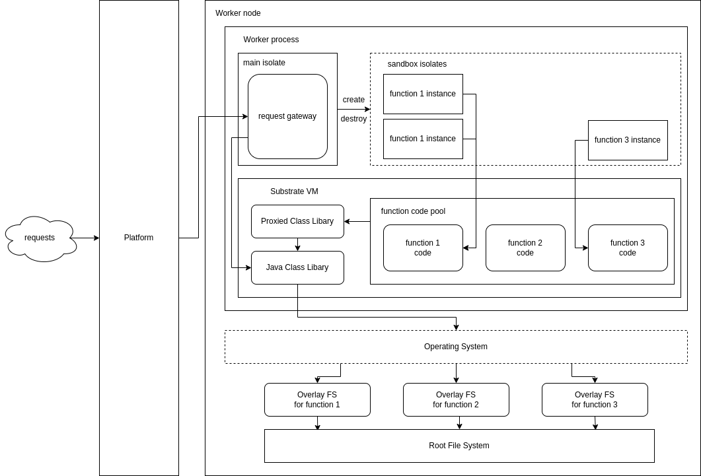

# Neutrino

a lightweight sandbox implementation for serverless computing powered by Graal Native Image and Substrate VM isolates

[See details in our paper](./.github/CS854_Neutrino.pdf)

---



## Build

Make sure a JDK 11 (or above) based Graal (with `native-image`) is installed and `JAVA_HOME` is set correspondingly:

```shell
$ mvn -Pnative package 
```

// TODO: add more documentation
